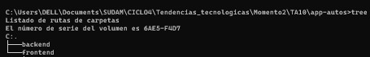
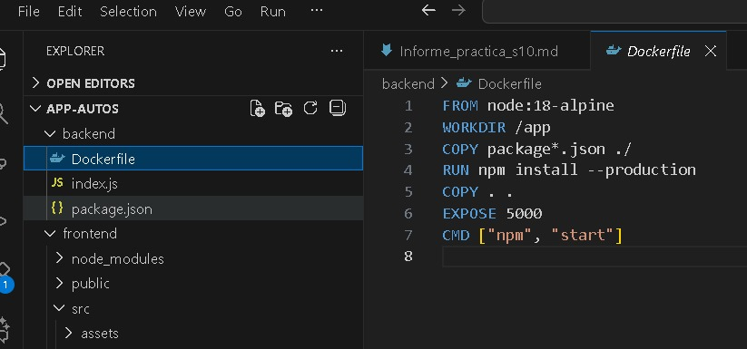
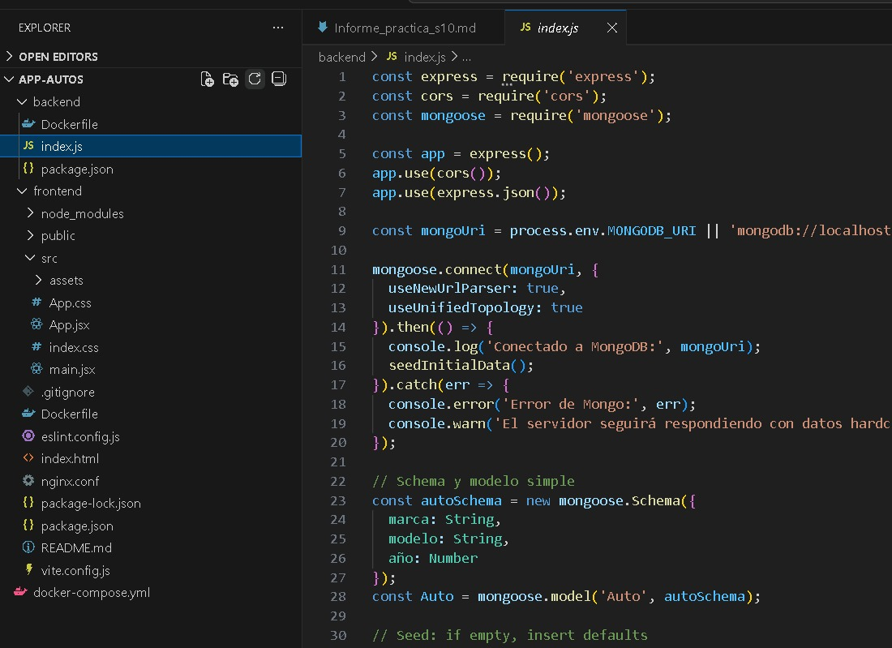
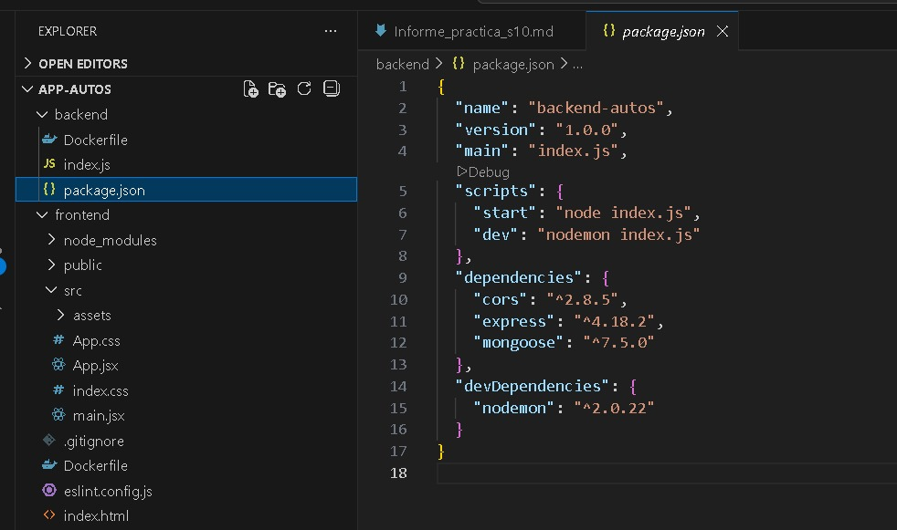
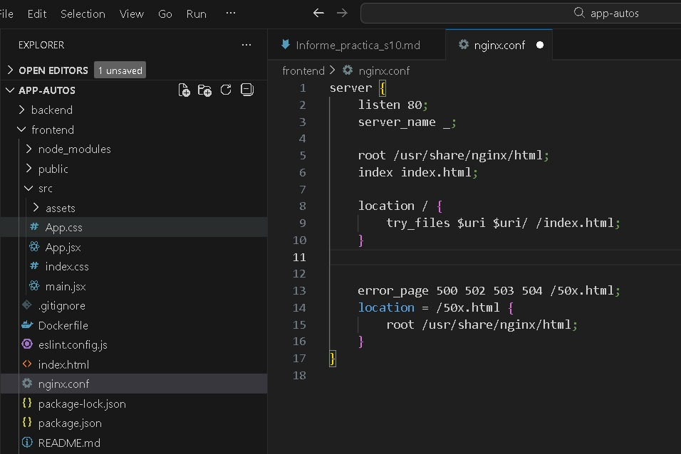
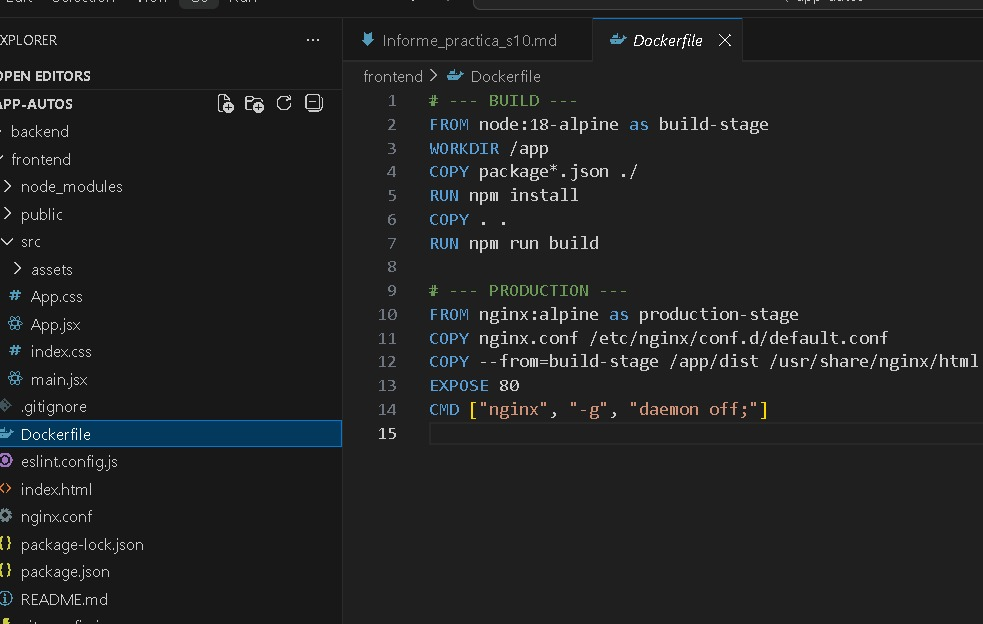
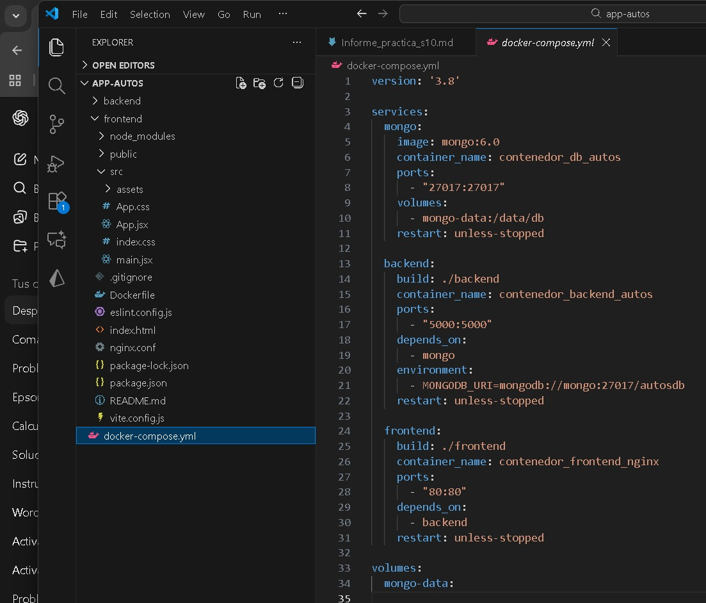
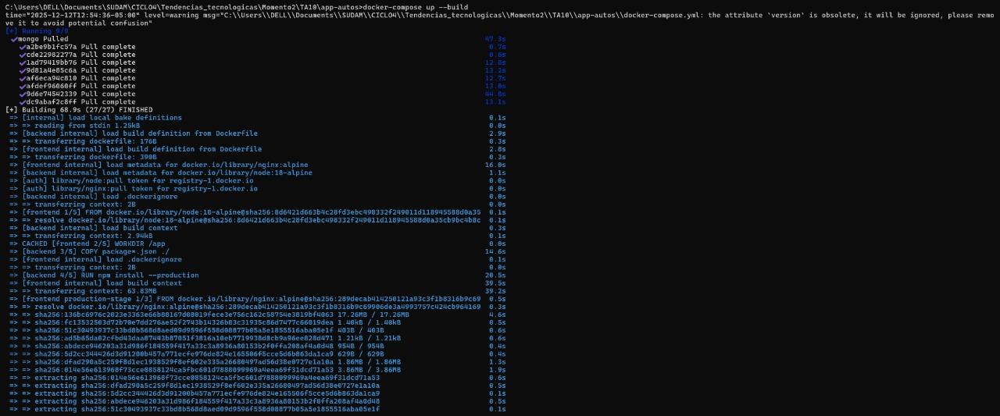
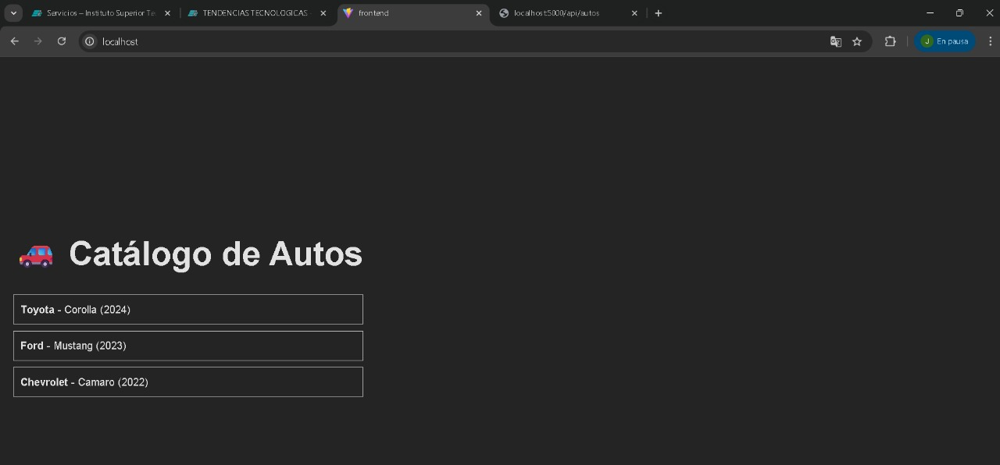
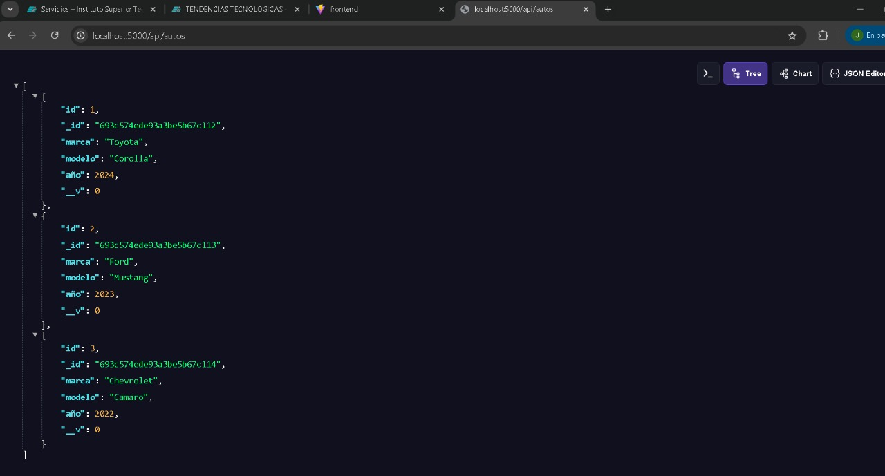

# Despliegue de Frontend - Backend - Base de Datos con Docker y Nginx

## 1. Título
**Despliegue de Frontend - Backend - Base de Datos usando Docker, Nginx y Docker Compose**

## 2. Tiempo de duración
**120 minutos** 

## 3. Fundamentos

### ¿Qué es Docker?

En esta práctica se desarrolla el despliegue completo de una aplicación compuesta por un frontend en React, un backend en Node.js/Express, y una base de datos MongoDB, todos ejecutándose en contenedores Docker gestionados mediante docker-compose. La práctica se enfoca especialmente en la construcción del frontend en modo producción usando un Dockerfile multi-stage, donde una primera etapa realiza el proceso de build utilizando Node.js, y una segunda etapa usa Nginx para servir los archivos estáticos generados.

Docker es una herramienta que permite empaquetar aplicaciones junto con todas sus dependencias dentro de contenedores, asegurando así ambientes reproducibles, portables y aislados. Con Docker Compose es posible definir múltiples servicios (contenedores) dentro de un solo archivo YAML, permitiendo orquestar toda la aplicación con un solo comando.

El frontend está construido con React y Vite, donde Vite genera la carpeta dist/ que contiene la versión optimizada de la aplicación. Esta carpeta es la que luego Nginx expone para el usuario final. Por su parte, el backend se desarrolló con Node.js y Express, proporcionando un endpoint REST (/api/autos) que devuelve una lista de autos. La base de datos elegida es MongoDB, ejecutada dentro de otro contenedor, accesible por el backend mediante su nombre de servicio en docker-compose.

El flujo general funciona así:

-El usuario accede al navegador → Nginx entrega el frontend.

-El frontend realiza una petición HTTP al backend.

-El backend responde con los datos, conectándose cuando sea necesario a MongoDB.

Este tipo de arquitectura es muy utilizada en aplicaciones modernas, ya que separa responsabilidades y permite escalar cada parte de manera independiente. Además, el uso de imágenes oficiales de Node, MongoDB y Nginx simplifica el despliegue en cualquier entorno, ya sea Windows, Linux o Mac.

La práctica también permite comprender conceptos clave como:

-Build de producción.

-Volúmenes Docker.

-Servicios interconectados por red interna.

-Contenedores multi-stage.

-Configuración mínima de Nginx para SPA (Single Page Applications).

Estas bases son fundamentales para desplegar aplicaciones modernas basadas en microservicios.

## 4. Conocimientos previos

Para realizar esta práctica se necesita tener claro los siguientes temas:

- Comandos básicos de Linux (cd, ls, mkdir, etc.).
- Manejo de terminal o consola.
- Conocimientos básicos de Docker (imágenes, contenedores, puertos).
- Manejo básico de Node.js.
- Entender qué es una base de datos MongoDB.
- Conceptos básicos de backend con Express.
- Conocimientos sobre React (estructura básica del proyecto).

## 5. Objetivos a alcanzar

-Implementar un frontend en modo producción utilizando contenedores Docker.

-Utilizar un Dockerfile multi-etapa para construir la aplicación y servirla con Nginx.

-Implementar un backend con Node/Express dentro de un contenedor.

-Desplegar una base de datos MongoDB en un contenedor separado.

-Integrar todos los contenedores usando Docker Compose.

-Validar la correcta comunicación entre frontend, backend y base de datos.

## 6. Equipo necesario

- Computador con Windows, Linux o macOS.
- Docker Desktop instalado o Docker Engine.
- Node.js instalado localmente para generar el frontend
- Editor de código.
- Terminal o PowerShell.

## 7. Material de apoyo

- **Documentación oficial de Docker**: https://docs.docker.com/
- **Documentación de Docker Compose**: https://docs.docker.com/compose/
- Documentación oficial de Docker.
- Cheat sheet de comandos de Linux.
- Documentación oficial de React y Vite.
- Documentación de Node.js y Express.
- Documentación oficial de React y Vite.

## 8. Procedimiento

### Paso 1: Crear la estructura de carpetas

### Paso 2: Configurar el backend (Node.js / Express)

### Paso 3: Configurar Nginx en Front

### Paso 4: Crear el Dockerfile Multi-Stage del frontend

### Paso 5: Crear docker-compose.yml

### Paso 6: Levantar la aplicación

## 9. Resultados esperados

Al finalizar la práctica, se espera el despliegue correcto de todo dentro de un entorno completamente contenerizado. En particular:

El frontend debe ser accesible desde el navegador a través de
http://localhost,mostrando la interfaz construida en React y servida por Nginx en modo producción.

La aplicación web debe mostrar la lista de autos, consumiendo correctamente el endpoint expuesto por el backend en http://localhost:5000/api/autos
El backend debe ejecutarse en su propio contenedor y mostrar en consola los mensajes de inicio, así como la confirmación de conexión a la base de datos MongoDB.

El contenedor de MongoDB debe iniciar correctamente y mantener el volumen asignado para el almacenamiento de datos persistentes.

Demostrando un despliegue limpio, reproducible y estructurado bajo una arquitectura basada en contenedores.

## 10. Bibliografía

- Docker, Inc. (2024). Docker documentation. https://docs.docker.com

- Node.js Foundation. (2024). Node.js documentation. https://nodejs.org/en/docs

- Meta Open Source. (2024). React documentation. https://react.dev

- Nginx, Inc. (2024). Nginx documentation. https://nginx.org/en/docs

- MongoDB, Inc. (2024). MongoDB manual. https://www.mongodb.com/docs

- Vite Contributors. (2024). Vite: Next generation frontend tooling. https://vitejs.dev